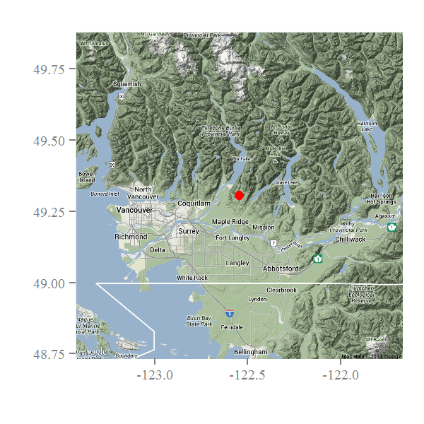
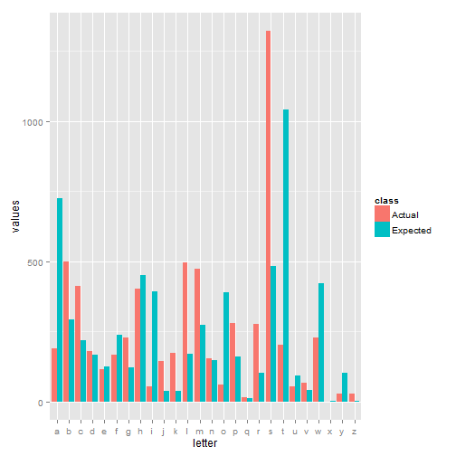

**Navigation - [Home](../README.html) - [Basic Search](../BasicSearches/BasicSearches.html)**

Basic Searches With `neotoma`
========================================================

Getting Started with Neotoma
--------------------------------------------------------
Just to make sure that everyone is getting started right, make sure you have the most recent version of `neotoma` installed:

```
install.packages("devtools")
require(devtools)
install_github("neotoma", "ropensci")
require(neotoma)
```


Searching with Neotoma
--------------------------------------------------------
The `neotoma` package provides a direct link to the Neotoma database through R.  Just like Neotoma you can search by location, taxon, elevation or age range, but unlike Neotoma you don't get little pins on a map (although we can try plotting that!).  With the `neotoma` package you get a data object returned by the API.

If you are doing exploratory work you will use a workflow that starts broadly, finding sites, and then the most likely function to start with is `get_datasets`, however, if you are searching for a specific site you can also use `get_sites`.  `get_datasets` is by far the more powerful search option, since it can return many sites, and a lot of information about those sites.  `get_sites` returns only a table of site information, and is only searchable by name, location or altitude.

`get_datasets` in contrast provides a number of other search options, including the ability to search by taxon, dataset type, location, age range, or any combination of these options.

Remember that help is always a keystroke away in R, using `?` and the function name.

### Our first search

We're going to use `get_sites` to look for something that we know exists, then find out something about the structure of the Neotoma database.  After that we're going to use `get_datasets` to do a broader search.  While we do that we're going to do some basic plotting.

**Exercise**: Let's see if we can't find a site we know is in Neotoma.  Here we're trying Marion Lake, but you can try any site you want.


```r
known.site <- get_sites(sitename = "Marion Lake*")
```


`get_sites` returns a `data.frame` object.  If you look at `known.site` (and the API worked) you'll notice a couple things:

1. The API returned a record to the variable `known.site`.
2. I didn't actually call for 'Marion Lake', I called for 'Marion Lake*'.  Take a look at the object `known.site` and see if you can figure out why we need to use the *.

If you download multiple sites, or have a map layer then you can plot out sites, or place the site on a map, as in **Figure 1**.

 

**Figure 1**. *Using R with `neotoma`, `ggplot` and `ggmap` can make some really great figures.  No need for MSPaint ever again!*

### Our Second Searches

It's called "Second Searches" plural because we're going to use the wildcard symbol `*` to help us out.  Interestingly, Neotoma allows [regular expression](http://en.wikipedia.org/wiki/Regular_expression) searches to be passed with text strings.  Regular expressions are incredibly powerful tools and are very much worth knowing.  They can mean the difference between a week of sorting out excel spreadsheets or old text documents, and a couple of hours of coding.  We used a wildcard in our search for Marion Lake because it's stored as *Marion Lake (CA:British Columbia)*, not simply *Marion Lake*.  This is worth knowing, especially if you are searching for a specific site and it doesn't turn up.

**Exercise:**
We want to know something about the site names in Neotoma.  In `R` it is possible to get all the letters of the alphabet using the variable `letters`.  Given what we've learned above and the table below, see if you can figure out whether or not site names in Neotoma have the same distribution of leading letters as the English language (hint: the $\chi^{2}$ test in R is called with `chisq.test`:

```
#  You can copy this block to use for the chi-squared test.  It is the frequency with which each letter in the alphabet is found as the leading letter in a word.
letter.dist <- c(.11602,.04702,.03511,.02670,.02007,.03779,.01950,
                 .07232,.06286,.00597,.00590,.02705,.04374,.02365,
                 .06264,.02545,.00173,.01653,.07755,.16671,.01487,
                 .00649,.06753,.00037,.01620,.00034)
```

 

**Figure 2**:  *Can you get something like this?  What if we only want pollen sites?  Why are there so many sites with S as the leading letter?  Why so few with a leading letter T?*

