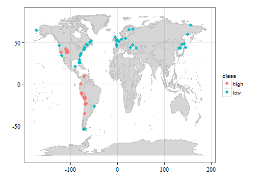

**Navigation - [Home](https://github.com/SimonGoring/Neotoma-Workshop_Oct2013/blob/master/README.md) - [Intro to R](https://github.com/SimonGoring/Neotoma-Workshop_Oct2013/blob/master/IntroToR/IntroR_1.md) - [Web Services & APIs](https://github.com/SimonGoring/Neotoma-Workshop_Oct2013/blob/master/WebServices/WebServices.md) - [Basic Search](https://github.com/SimonGoring/Neotoma-Workshop_Oct2013/blob/master/BasicSearches/BasicSearches.md) - [Pollen Objects](https://github.com/SimonGoring/Neotoma-Workshop_Oct2013/blob/master/PollenObjects/PollenObjects.md) - [Manipulating Pollen](https://github.com/SimonGoring/Neotoma-Workshop_Oct2013/blob/master/ManipulatingPollen/manipulating.pollen.md)**

-------------------------------------


What is a 'Pollen Object' and how do I get one?
========================================================
The `neotoma` package tries to collect and return data in a format that makes sense to the users and can be easily used by other packages.  The different functions in `neotoma` return different types of objects.  You already saw that `get_sites` returns a table that is a `data.frame`.  This is because the variables of interest for sites are both numeric (latitude and longitude) and character (site descritption).  When we look at more complex data objects you will see that they are different variable types:

**Table 1**. *The variable types returned by the neotoma package*

**Function** | **Returned variable**
------------ | ---------------------
get_contacts | `data.frame` with contact information for investigators.
get_datasets | `list` of `lists` with information about each dataset.
get_download | `list` of `lists` with dataset and assemblage information.
get_publication | `data.frame` with publication information.
get_sites | `data.frame` with site information.
get_table | `data.frame`, content depends on the table of interest.
get_taxa | `data.frame` with taxon information.

All of the API calls that the package uses return long text strings in a JSON format.  The package itself uses R commands to convert the raw text into data objects that ought to be useful for analysis.  In many ways this will be an ongoing discussion.  We want to make the package useful to the community, so if you have ideas please don't hesitate to contact us.  Because we've tried to write the package in an open manner, and because we've hosted it on GitHub, you can look at the raw code that we use (and you can contribute if you'd like) [here](https://github.com/ropensci/neotoma).

For most searches or workflows you want to use two main data objects, `datasets` and `downloads`.  I will refer to the object returned by `get_downloads` as the pollen object, although it could also contain mammal fossils, or other data types contained in the Neotoma database.

To help us work through the rest of these examples we should come up with a research question that will show off how we use the package in a research work-flow.  I have an idea that in the last 1000 years low elevation sites have shown greater rates of pollen turnover than high elevation sites because of land use change.

-------------------------------------------------

**H<sub>0</sub>**: *There is no difference in mean turnover between low elevation and high elevation sites.*

**H<sub>1</sub>**: *High elevation sites show lower rates of turnover than low elevation sites in the last 1000 years.*

**H<sub>2</sub>**: *High elevation sites show lower rates of turnover than low elevation sites in the last 1000 years, and show a faster rate of increase in the near-modern.*

-------------------------------------------------

So how can we test this theory?  To do this we need two sets of data.  This isn't going to be thorough, because we're just showing off the package, but we can try to do things semi-fomally.  What will out workflow be?  Lets write it up:

1.  Divide sites into "high" and "low" elevation bins.
  * Low elevation:  1 - 10m asl
  * High elevation: 3000+m asl
2.  Find pollen sites in the high and low bins
  * Use `get_datasets` for each elevation bin.  I'm going to call the variables `high.el` and `low.el`
  * Plot out site locations for our information.
3.  Get the pollen data using `get_downloads`
4.  Standardize the pollen taxonomies using `compile_list`
5.  Calculate turnover for the last 1000 years.
6.  Test for differences between low & high elevation sites.
7.  Publish our group paper, call Nobel committee.

Find pollen sites & plot locations
----------------------------------------
`get_datasets` can return a list of pollen sites that have samples within a specific age & elevation bin.  Use `?get_datasets` to see if you can figure out the variables you need to get your high and low elevation sites.


How many sites were returned for each call?  The package itself returns a message to tell you directly, and since the objects are lists you could type `length(high.el)` or `length(low.el)` to figure out how many sites there were for each search.

Each object has the form:

```
high.el
 \- Site 1
 \- Site 2
 :
 :
 \- Site n
```

Where each site has its own entry.  So if you wanted to see the the first site you could call `high.el[[1]]`.  Notice the use of the double square brackets.  Lets take a look at the object.  First look at the names of the list objects:

**Box 1**. *The object returned by `get_datasets`*

```r
names(high.el[[1]])
```

```
##  [1] "CollectionUnitID" "CollUnitType"     "CollUnitHandle"  
##  [4] "DatasetName"      "DatasetType"      "DatasetPIs"      
##  [7] "AgeOldest"        "AgeYoungest"      "SubDates"        
## [10] "Site"             "DatasetID"
```


Then, we can look at the site information for our sites since one of the attributes of each of the datasets is `Site`.  So look at the site information for the first `high.el` object using `high.el$Site`.  Is your site called *Aguilar*?  If it is then you are awesome.

We can get more information using the `sapply` command to turn the Site information into a big table, but really all we want are the lat/longs right now.  We want to make a plot like this:

 

**Figure 1**. *The locations of all your sites, but I cheated a bit, mostly to show you what nice figures R can do using `ggplot2` and `ggmap`.*

This figure may be a bit nicer than you can do quickly in the workshop, but if you want to see how I did it then you can go [here]() and look at the raw code for this workshop.

So, our test is going to have a bit of trouble since it is really based on the onset of European settlement in North America.  We have a number of sites in Europe, Asia and South America.  Well, this could be a problem, or we could use it as validation later on.  For now, lets take all the pollen data we can get, and then do any sub-sampling later.

Getting the pollen data
---------------------------------------------

The function `get_download` works with either a DatasetID or a vector of DatasetIDs.  Out dataset objects (above) have a variable called `DatasetID`, so we can get a vector of dataset IDs using the `sapply` function:


```r
sapply(high.el, function(x) x$DatasetID)
```

```
##  [1]   15   17   32  250  351  355  356  506  509  514  537  719 1443 1579
## [15] 1631 1646 1654 1672 1674 1679 1758 1761 1762 1774 1894 2026 2049 2069
## [29] 2323 2326 2588 2644 2665 2674 2880 2900 2901 3056 3479 3494
```


So if we want to pull down all of our pollen sites for each sample site we can next our `sapply` function into the `get_download` command:


```r
high.pol <- get_download(sapply(high.el, function(x) x$DatasetID))
low.pol <- get_download(sapply(low.el, function(x) x$DatasetID))
```


The downloaded objects are the real key.  They're the things that are best about the package.  This contains all your site information.  Again, the length of the `high.pol` and `low.pol` objects should be the same as for the `high.el` and `low.el` objects, you can check if you'd like using `length`, but the shape of each individual pollen object is quite different.

```
high.pol
 \- metadata (list)
     \- dataset    (table)
     \- site.data  (table, sim. to dataset 'Site')
     \- pi.data    (list for each PI)
 \- sample.meta    (data.frame, chronology & depth data)
 \- taxon.list     (data.frame, taxonomic data)
 \- counts         (data.frame, all assemblage data)
 \- lab data       (data.frame, lab data)
 
```

Now that we've got the pollen objects we want to do something with them.

-----------------

**Navigation - [Home](https://github.com/SimonGoring/Neotoma-Workshop_Oct2013/blob/master/README.md) - [Intro to R](https://github.com/SimonGoring/Neotoma-Workshop_Oct2013/blob/master/IntroToR/IntroR_1.md) - [Web Services & APIs](https://github.com/SimonGoring/Neotoma-Workshop_Oct2013/blob/master/WebServices/WebServices.md) - [Basic Search](https://github.com/SimonGoring/Neotoma-Workshop_Oct2013/blob/master/BasicSearches/BasicSearches.md) - [Pollen Objects](https://github.com/SimonGoring/Neotoma-Workshop_Oct2013/blob/master/PollenObjects/PollenObjects.md) - [Manipulating Pollen](https://github.com/SimonGoring/Neotoma-Workshop_Oct2013/blob/master/ManipulatingPollen/manipulating.pollen.md)**
